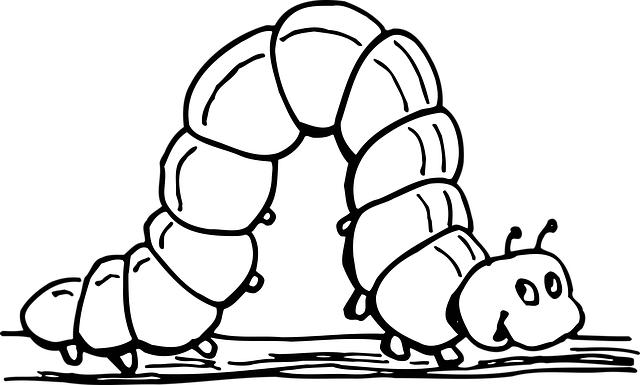

<h1>Larva.js</h1>

A(n other...) framework to develop web applications.

## Getting started

[Read the tutorial here.](https://github.com/yannickdebree/larva.js/wiki)

## Philosophy

Larva.js was originally developed for a personal challenge : create a JS framework that use functionnal programmming paradigm and provide an API composed of chaining functions.
No performance revolution or competition with existing frameworks, just fun :blush:.
